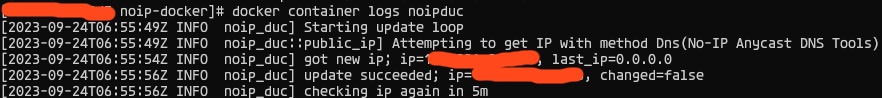

# NO-IP Duc Docker 版
家里的华硕路由器本来自带DDNS功能，用华硕自己的DDNS服务，一直也用得好好的，不知道从什么时候起不能用了，连带其他DDNS服务器也不能用了。
后来在网上找到[no-ip](https://noip.com)，免费用户提供一个ddns，而且不验证身份。
## Build
``` bash
docker build . -t noip-docker:debian
```
## Use
``` bash
docker run -d --name noipduc --restart=always noip-duc:debian -g 'you_domain' --username 'your_username' --password 'your_password' 
```

看看日志成功了，默认每5分钟检查一次。

## 参考
noip: [How to Install the Linux 3.x Dynamic Update Client (DUC)](https://www.noip.com/support/knowledgebase/install-linux-3-x-dynamic-update-client-duc#install_from_source)